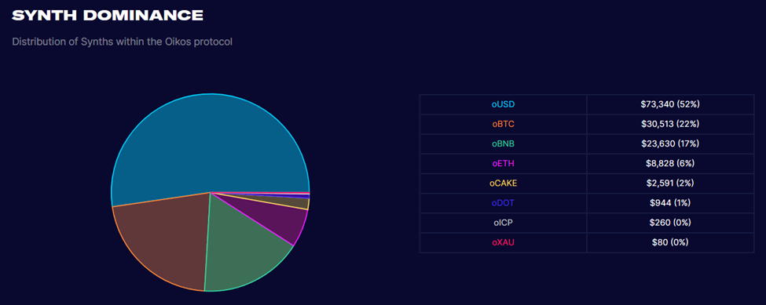

### How does Oikos treat "debt"?
Now what happens to stakers if synth prices don’t move in their desired direction? First we need to understand how Oikos treats “debt”. When users mint and stake, they're taking on a portion of the platform’s total debt. If the staker's assets do well, they end up collecting money from people that bet on assets that didn’t do well. If the staker holds an asset that doesn’t move much, they could still end up owing to the platform pool. Let’s say the staker is holding a stablecoin (e.g. oUSD) or a fiat currency, and most others on the platform are holding oBNB. If BNB has a huge upward swing, the staker could be penalized for this and end up owing money. Conversely, if the staker's asset doesn’t move (e.g. oXAU, which stands for synthetic Gold) but everyone else’s assets generally drop, you stand to gain a profit. As demonstraded in the example below If the staker is on the losing end of this arrangement, they will end up owing money to the platform – kind of.

| | John | James | Total Debt |
|-------|-------|-------|-------|
| **Step 1** Starting oUSD | 50,000 | 50,000 | 100,000 |
| **Step 2** oBNB, oUSD | 50,000 | 50,000 | 100,000 |
| **Step 3** oBNB, oUSD | 75,000 | 50,000 | 125,000 |
| **Step 4** Debt Owned | 62,500 | 62,500 | 125,000 |
| **Net Profit** | +12,500 | -12,500 | |

As it's explained in the [burn section](burn.md) of this guide, the protocol expects all of it’s synthetic assets to be over-collateralized to 500%. If the user's mint or stake falls below this ratio, they will no longer be able to collect rewards from the weekly OKS inflation or trading fees generated from the protocol. In order to continue collecting rewards, they’ll need to either burn a portion of your minted tokens or add more OKS to their staking wallet.

### Debt hedging for Stakers
Since Minters see their individual debt go up when the global debt pool increases, one strategy is to hedge against changes in the debt pool by roughly mirroring the global distribution of synths on an individual basis.

For example, if oBTC is 22% of the pool, oBNB is 17% of the pool, oETH is 6% of the pool, oCAKE is 2% of the pool, oDOT  for 1% of the pool, and the remaining 52% of the synths are oUSD, a Minter might choose to allocate 22% of his Synths in oBTC, 17% in oBNB, 6% in oETH, 2% in oCAKE, 1% in oDOT, and 52% in oUSD. In fact this is the approximate distribution of all the synths in circulation.

 *Source: [Oikos Stats](https://stats.oikos.cash)*

This is the mirroring strategy that Minters can employ to hedge against major changes in the debt-pool. This strategy requires an individual Minter to rebalance his Synth allocation as the global distribution changes. If oETH goes 5x, the Minter has exposure to this price growth and won't get rekt on his debt. In another scenario where a Minter who has a synth allocation of 100% oBTC, or 100% oUSD, and oETH goes 5x in price while oBTC and oUSD stayed flat, the Minter will be strictly worse off, and will owe more debt than his synths are worth.
