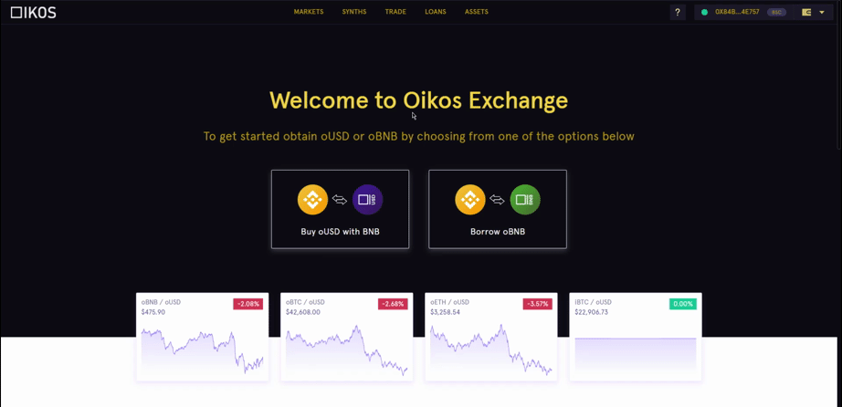
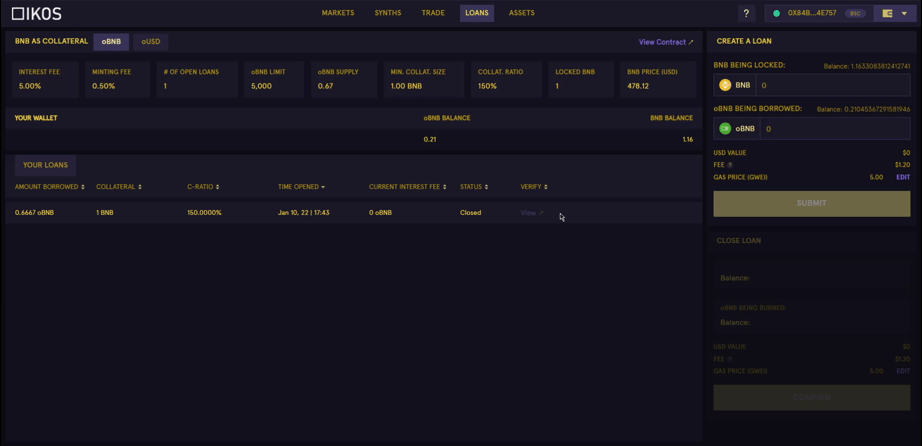

### Taking out a Loan

Users can take out a loan against the BNB that they are holding and can generate oBNB. One important point to note here is that oBNB minters are not stakers. Hence, they have no obligation towards the debt pool. They just need to pay the oBNB that they have generated plus interest fee, and they neither receive any exchange rewards nor inflationary OKS rewards. 

*Borrowers have no obligation towards the global debt pool*

Users can visualize the following loan information of the selected pair on the right hand side of the panel:
- Minimum collateral size
- Total locked BNB
- Current BNB price
- Number of open loans
- Minting fee
- Interest fee, etc.

*Note: Users need to have a minimum of 1 BNB to take out a loan.*

### Liquidation mechanism

The default liquidation ratio for BNB collateral is 150%, i.e., if the collateral ratio falls below this liquidation ratio, the loan will be liquidated. The platform also gives you the flexibility to adjust the C-Ratio (Safe-200%, Safe Max-165%, and High Risk-155%). Also, users need to pay a liquidation penalty to the liquidators.