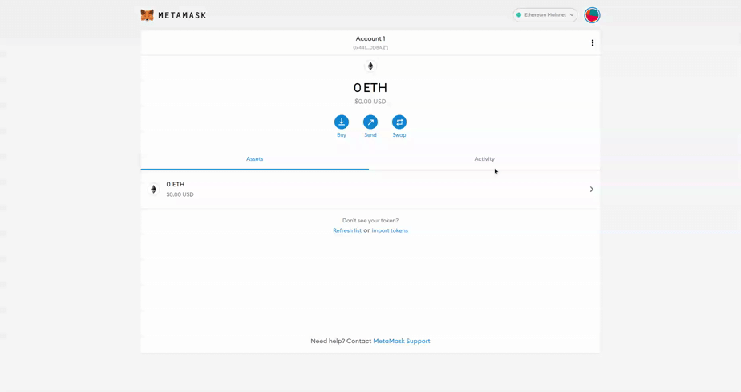

### What is MetaMask?
MetaMask is a software [cryptocurrency wallet](/wallets) used to interact with the web3. It allows users to access their Ethereum wallet through a browser extension or mobile app, which can then be used to interact with decentralized applications. MetaMask is developed by ConsenSys Software Inc., a blockchain software company focusing on Ethereum-based tools and infrastructure.

### Why choose MetaMask?
MetaMask wallet has shown to be quite effective, especially for use on the BNB Chain (BSC) and in decentralized finance (DeFi) as a whole. This guide will assist you in setting up a MetaMask wallet on BSC.

### Connecting MetaMask to BSC

*Be sure to store your keyphrase safely*

#### Step 1: Open MetaMask and Create/Import Wallet
Open the MetaMask wallet using your desktop or phone and Open a wallet or import one, if already done skip to step 2.

*Adding BSC Network*

#### Step 2: Add Network
Select "Settings", navigate to "Networks" and click "Add Network".

#### Step 3: Set up BSC Mainnet
Input the following information:

| Info | Description |
| ----------- | ----------- |
| **Network Name** | BSC Mainnet |
| **New RPC URL** | https://bsc-dataseed1.binance.org/ or https://bsc-dataseed2.binance.org/ |
| **ChainID** | 56 or 0x38 if 56 doesn't work |
| **Symbol** | BNB |
| **Block Explorer** | https://bscscan.com/ |

#### Step 4: Connect to BSC
Select the newly added 'BSC Mainnet network' and you should now be connected to the BNB Chain network.

#### After setting up MetaMask
Once these steps are followed users will be able to access nealy all decentralized applications on the BNB Chain. This wallet supports all crypto assets on the BSC, if not listed in your wallet be sure to add the custom token to MetaMask using the specific token contract address. 

### Adding a Custom Token

*Adding Oikos Network Token (OKS) to MetaMask*

Using a crypto wallet such as Metamask can present some issues, especially for people new to crypto. One of the common setbacks reported by BNB Chain (BSC) users with MetaMask is not being able to visualize a particular token which they have received in their wallets.

This guide shows how to find all your BSC tokens and enable them in your MetaMask wallet.

#### Step 1: Set up BNB Chain
To confirm you are on the correct network, open MetaMask and click on 'Wallet' at the top of the screen. Check if BSC Mainnet is in the list of available networks. 

If BSC is not available, follow our 'Connect Metamask to BSC' in this guide to configure BNB Chain on your MetaMask wallet. 

#### Step 2: Add Custom Tokens
After your Metamask has been set up for BSC, you can now add BEP-20 tokens to your wallet. In this example, we will illustrate using the Oikos Network token, OKS. 

Visit BSC's blockchain explorer, [BSCScan](https://bscscan.com/). Enter the token name in the search bar and from the dropdown tab scroll through the list and click on the token you want to add to Metamask: OKS in our example.

#### Step 3: Copy Contract Address
On the token's explorer page, tap the 'Copy' symbol to copy the token's contract address. 

#### Step 4: Open MetaMask
Open MetaMask. At the top of the screen tap 'Wallet' and select BSC Mainnet.

#### Step 5: Import Tokens
At the base of the screen, click 'Import Tokens'.

#### Step 6: Add Token
In the Custom Token page, paste the token's contract address you copied during Step 3 into the 'Token Address' bar. After a few moments, MetaMask should autofill 'Token Symbol' and 'Decimal of Precision'. If MetaMask fails to autofill, get the information from the token's BSCScan page and input it manually.

#### Step 7: Click 'Add Token'. 
Go back to your MetaMask wallet page. The token you just added will be displayed.

Following the steps outlined in the guide above will enable you to locate all your BSC tokens, and add them to your Metamask wallet.
